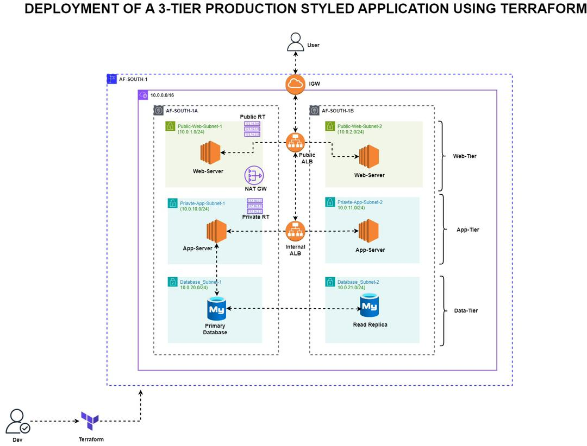

📚 Book Review App — Terraform Infrastructure
A production-ready Terraform scaffold for deploying a three-tier web application on AWS, featuring load balancing, auto-scaling, and a managed RDS database.

🏗️ Architecture Overview

The infrastructure follows a classic three-tier architecture:

Web Tier — Public EC2 instances behind a public ALB
App Tier — Private EC2 instances behind an internal ALB
Database Tier — Private RDS MySQL instance accessible only from the app tier

Project Structure
book-review-terraform/
├── main.tf                  # Root module — orchestrates all child modules

├── variables.tf            # Root-level input variable definitions

├── outputs.tf              # Root-level outputs (VPC ID, instance IPs, endpoints)

├── terraform.tfvars        # Variable values ⚠️ EXCLUDED from git

├── .gitignore              # Ignores sensitive files

├── README.md               # This file
├── DEPLOYMENT_GUIDE.md     # Step-by-step deployment instructions

│
└── modules/
    ├── networking/         # VPC, subnets, gateways, route tables
    ├── security/           # Security groups and firewall rules

    ├── ec2/                # Web and app server EC2 instances

    ├── alb/                # Public and internal Application Load Balancers

    └── database/           # RDS MySQL instance

    
Each module follows a consistent pattern:
modules/<name>/
├── main.tf        # Resource definitions
├── variables.tf   # Module inputs
└── outputs.tf     # Module outputs

🧩 Module Descriptions
1. networking
Establishes the network foundation for the entire infrastructure.

VPC with a configurable CIDR block
2 public subnets (web tier)
2 private subnets (app tier)
2 private subnets (database tier)
Internet Gateway, NAT Gateway, and route tables

Dependencies: None (deployed first)

2. security
Defines security groups and ingress/egress rules for all tiers.
Security Group Purpose pub_alb_sgPublic ALB — allows port 80 from anywhereweb_sgWeb servers — allows port 80 from ALB, SSH from anywhere internal_alb_sgInternal ALB — allows port 3001 from web tier app_sg App servers — allows port 3001 from internal ALB, SSH from web tierdb_sgDatabase — allows port 3306 from app tier only
Dependencies: VPC (networking module)

3. ec2
Provisions EC2 instances for both web and application tiers.

Web server — public subnet, public IP, Ubuntu 24.04
App server — private subnet, NAT gateway access, Ubuntu 24.04
SSH key pair for management access

Dependencies: VPC subnets, security groups

4. alb
Configures Application Load Balancers for traffic routing.

Public ALB — listens on port 80, routes to web tier
Internal ALB — listens on port 3001, routes to app tier
Health checks on / (web) and /health (app)

⚠️ Note: Your app server must expose a /health endpoint returning HTTP 200. If it doesn't, update the health check path in modules/alb/main.tf.

Dependencies: VPC, security groups, EC2 instances

5. database
Deploys a managed RDS MySQL instance in the private database subnet.

MySQL 8.0, port 3306
20 GB storage (configurable)
Multi-AZ support for production
Automated backups with 7-day retention
Encryption at rest enabled

Dependencies: VPC subnets, security groups

⚙️ Prerequisites
Before deploying, ensure the following tools are installed and configured:
bash# Terraform v1.0+
terraform --version

# AWS CLI v2
aws --version

# Configure AWS credentials
aws configure

 Quick Start
Step 1 — Create an SSH Key Pair
bashaws ec2 create-key-pair \
  --key-name <your-key-name> \
  --region <your-region> \
  --query 'KeyMaterial' \
  --output text > my-app-key.pem

chmod 400 my-app-key.pem

Step 2 — Configure Variables
Create a terraform.tfvars file in the root directory:
hclaws_region        = "us-east-1"
project           = "book-review"

# VPC & Subnets
vpc_cidr_block    = "10.0.0.0/16"
web_subnet_1_cidr = "10.0.1.0/24"
web_subnet_2_cidr = "10.0.2.0/24"
app_subnet_1_cidr = "10.0.10.0/24"
app_subnet_2_cidr = "10.0.11.0/24"
db_subnet_1_cidr  = "10.0.20.0/24"
db_subnet_2_cidr  = "10.0.21.0/24"

# EC2
web_instance_type = "t3.micro"
app_instance_type = "t3.small"
keyname           = "my-app-key"

# RDS
allocated_storage = 20
db_name           = "bookreview"
engine            = "mysql"
engine_version    = "8.0"
instance_class    = "db.t3.micro"
username          = "admin"
password          = "YourSecurePassword123!"  # ⚠️ Change this!

⚠️ Never commit terraform.tfvars to version control. It contains secrets.

Step 3 — Deploy
bashterraform init      # Download providers and initialize
terraform validate  # Check configuration for errors
terraform plan      # Preview what will be created
terraform apply     # Deploy infrastructure (type 'yes' to confirm)
Step 4 — Verify
bash# View all outputs
terraform output

# SSH into web server
ssh -i my-app-key.pem ubuntu@$(terraform output -raw web_server_public_ip)(Though i have a user script for direct deployment enabled)

# Get RDS endpoint
terraform output -raw rds_endpoint

🔧 Common Tasks
bash# List all managed resources
terraform state list

# Inspect a specific resource
terraform state show <resource_name>

# Destroy a specific resource
terraform destroy -target=module.database.aws_db_instance.main

# Tear down everything
terraform destroy

🛠️ Troubleshooting
Error Solution Key pair does not exist: Create the key pair (see Step 1)

Insufficient capacity in AZ :Try a different instance type or region 

App server health check failing: Ensure /health endpoint exists or update health check path in modules/alb/main.tf

 Cannot connect to database Verify the app security group has an outbound rule to the DB security groupterraform init fails Run aws configure or export AWS_ACCESS_KEY_ID / AWS_SECRET_ACCESS_KEY

🔒 Security Considerations
Item Status SSH access scoped per tier✅Database only accessible from app tier✅Secrets excluded from git✅RDS password hardened for production⚠️ Change default SSH CIDR restricted (not 0.0.0.0/0)⚠️ Recommended for productionRDS encryption and backups enabled✅

📚 Resources

Terraform Documentation
AWS Provider for Terraform
Terraform Best Practices

For detailed deployment steps, see DEPLOYMENT_GUIDE.md.